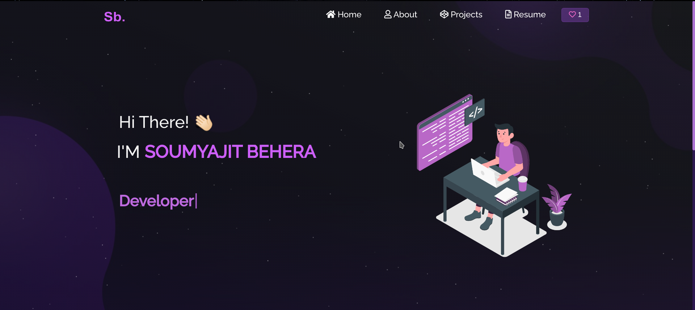

<div align="center">



# 🚀 Abhay Sharma — Developer Portfolio

### *Software Developer · Freelancer · MERN Stack Developer*

<br/>

[](https://your-portfolio-link.vercel.app)
[](https://github.com/abhay-sharma-0608)
[](https://www.linkedin.com/in/abhay-sha/)

<br/>


</div>

---

## 📋 Table of Contents

- [✨ About](#-about)
- [🛠️ Tech Stack](#️-tech-stack)
- [📁 Projects](#-projects)
- [🗂️ Project Structure](#️-project-structure)
- [⚙️ Getting Started](#️-getting-started)
- [🔗 Connect With Me](#-connect-with-me)

---

## ✨ About

A **modern, responsive personal portfolio** built with React.js to showcase my freelance work, projects, and skills. Features animated particle backgrounds, smooth routing, a typewriter effect, and an integrated GitHub activity calendar.

> Built for performance, designed for impact.

---

## 🛠️ Tech Stack

### 💻 Languages & Frameworks

| Technology | Technology | Technology | Technology |
|:-:|:-:|:-:|:-:|
|  |  |  |  |
|  |  |  |  |

### 🗄️ Databases & Tools

| Technology | Technology | Technology | Technology |
|:-:|:-:|:-:|:-:|
|  |  |  |  |

### 🎨 Styling

| Technology | Technology |
|:-:|:-:|
|  |  |

### 📦 Key Libraries Used in This Portfolio

| Package | Purpose |
|---|---|
| `react-tsparticles` | Animated particle background |
| `typewriter-effect` | Typewriter animation on hero section |
| `react-parallax-tilt` | 3D tilt effect on project cards |
| `react-github-calendar` | Live GitHub contribution graph |
| `react-router-dom` | Client-side routing |
| `react-bootstrap` | Responsive grid & UI components |
| `@react-pdf/renderer` | Resume PDF generation |

---

## 📁 Projects

### 🍽️ LUMINA — Restaurant Website
> Modern restaurant website with elegant dark theme and interactive menu.

[](https://github.com/abhay-sharma-0608/Restaurant-SIte)
[](https://restaurant-site-liart.vercel.app/)

- Built with **Vite + React.js** for lightning-fast performance
- Elegant dark theme with refined UI and engaging visuals
- Fully responsive with reusable component architecture

---

### 💪 One Pager — Fitness Website
> High-performance single-page fitness website with dynamic animations.

[](https://github.com/abhay-sharma-0608/One-Pager)
[](https://one-pager-xi.vercel.app/)

- Built with **React.js** with seamless scroll navigation
- Highlights gym services, programs, and transformation stories
- Immersive UX with smooth animations and responsive design

---

### 🛒 Amazon Clone — Full Stack E-Commerce
> Full-featured Amazon clone with authentication, cart, and checkout.

[](https://github.com/abhay-sharma-0608/Amazon-Clone)
[](https://amazon-clone-two-eosin.vercel.app)

- Built with **React.js + Node.js** full-stack architecture
- Features user authentication, product listing, cart & checkout
- Secure backend APIs with dynamic state management

---

### 👗 DRAPE — Fashion E-Commerce Site
> Sleek, fast fashion e-commerce site with category browsing and product previews.

[](https://github.com/abhay-sharma-0608/Fashion-Site)
[](https://fashion-site-beryl.vercel.app/)

- Built with **Vite + React.js** for blazing fast load times
- Responsive design with interactive product UI across all devices
- Sleek, modern aesthetic built for premium shopping experience

---

## 🗂️ Project Structure

```
Freelancing-Portfolio-main/
├── public/
│   ├── index.html
│   ├── favicon.png
│   └── manifest.json
├── src/
│   ├── Assets/
│   │   ├── Projects/         # Project screenshots & SVGs
│   │   └── TechIcons/        # Tech stack SVG icons
│   ├── components/
│   │   ├── Home/             # Hero section & typewriter
│   │   │   ├── Home.js
│   │   │   ├── Home2.js
│   │   │   └── Type.js
│   │   ├── About/            # Tech stack & GitHub calendar
│   │   │   ├── About.js
│   │   │   ├── Techstack.js
│   │   │   └── Github.js
│   │   ├── Projects/         # Project cards grid
│   │   │   ├── Projects.js
│   │   │   └── ProjectCards.js
│   │   ├── Resume/           # PDF resume viewer
│   │   ├── Navbar.js
│   │   ├── Footer.js
│   │   └── Particle.js       # tsParticles background
│   ├── App.js
│   └── style.css
├── package.json
└── README.md
```

---

## ⚙️ Getting Started

### Prerequisites

- Node.js `v16+`
- npm or yarn

### Installation

```bash
# Clone the repository
git clone https://github.com/abhay-sharma-0608/Freelancing-Portfolio.git

# Navigate to the project
cd Freelancing-Portfolio

# Install dependencies
npm install

# Start development server
npm start
```

The app will be running at `http://localhost:3000` 🚀

### Build for Production

```bash
npm run build
```

---

## 🔗 Connect With Me

<div align="center">

[](https://github.com/abhay-sharma-0608)
[](https://www.linkedin.com/in/abhay-sha/)

<br/>

*Feel free to ⭐ this repo if you found it helpful!*

</div>
